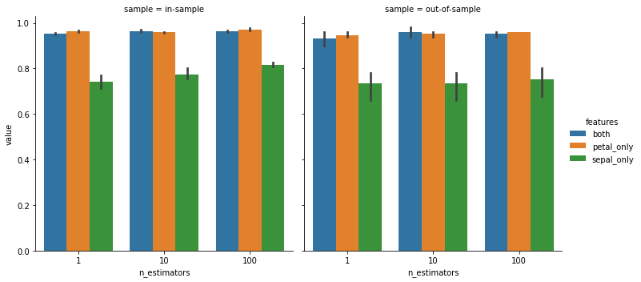

# Evaluation of a random forest classifier

_Accuracy of a cross validation of a random classifier. The left and right panel show the in the in-sample (training) and out-of-sampel (test) accuracy, respectively. The right panel shows the out-of-sample accuracy on cross validated test_
